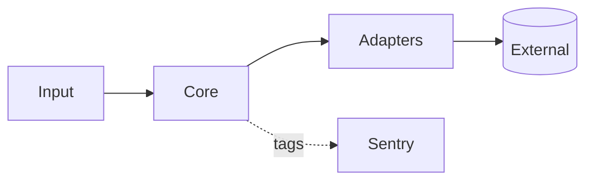

# System overview

> TODO: replace with this project's architecture.

## Purpose

One paragraph: what the system does and for whom.

## Components

- **core** — pure domain logic.
- **adapters** — integrations with external services (behind interfaces).
- **observability** — Sentry init + component tagging.
- **config** — typed settings, the only place that reads the environment.

## Data flow

